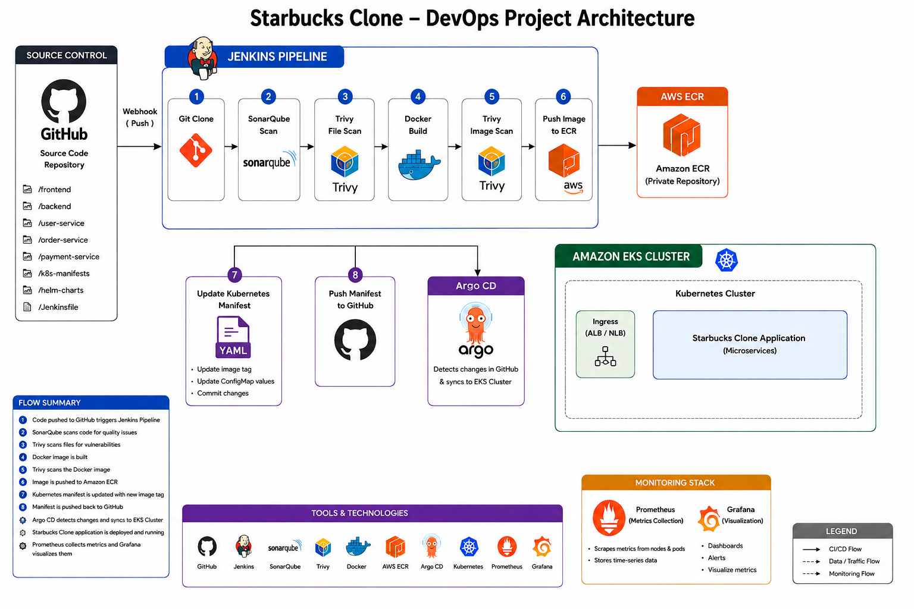
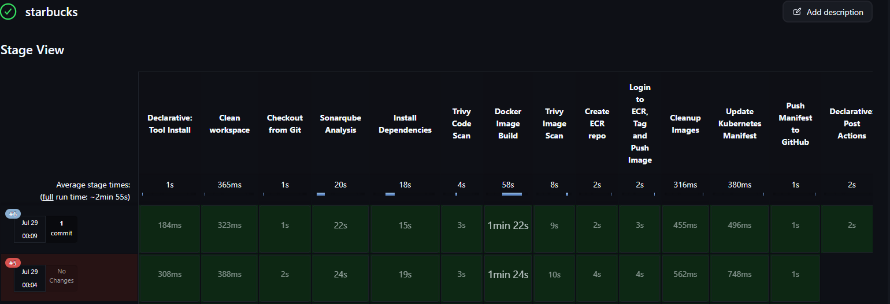
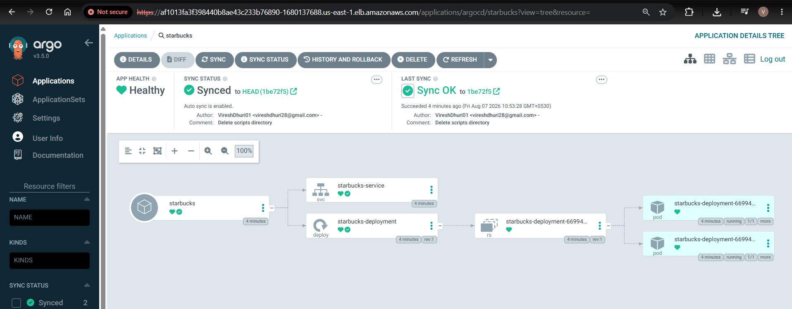
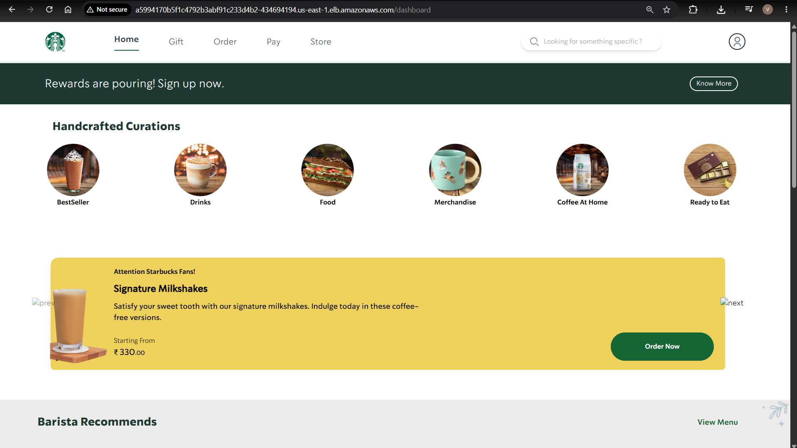

## ☕ Starbucks Clone - DevOps Project

Built an end-to-end DevOps pipeline for a Starbucks Clone application using Jenkins, Docker, Kubernetes, Amazon EKS, and Argo CD. Integrated SonarQube and Trivy for code quality and security scanning, with Prometheus and Grafana for monitoring.

---

### 📌 Project Architecture

<p align="center">
  
  </p>

---

### 🚀 Project Workflow

```text
GitHub
   │
   ▼
Jenkins Pipeline
   │
   ├── Git Clone
   ├── SonarQube Analysis
   ├── Quality Gate
   ├── Trivy File System Scan
   ├── Docker Build
   ├── Trivy Image Scan
   ├── Push Image to AWS ECR
   ├── Update Kubernetes Manifest
   ├── Push Manifest to GitHub
   └── Email Notification
            │
            ▼
         Argo CD
            │
            ▼
      Amazon EKS Cluster
            │
            ▼
       Starbucks Clone

Monitoring

Prometheus → Grafana
```

---

### 📸 Project Screenshots

### Jenkins Pipeline

<p align="center">
  
  </p>

### Argo CD

<p align="center">
  
  </p>

## Starbucks Clone

<p align="center">
  
  </p>

### 🛠️ Tech Stack

***GitHub, Jenkins, SonarQube, Trivy, Docker, AWS ECR, EC2, EKS, Helm, Argo CD, Prometheus and Grafana***

### ⚙️ Prerequisites

***Install all the important setups as provider in installations folder.***

---

### 🚀 Phase 1 - Jenkins Setup

*Required Plugins*
- Eclipse Termium Installer
- Sonarcube scanner
- Nodejs 
- Docker plugins
- Pipeline Stage view
- Prometheus

*Required Credentials*
- GitHub Token
- SonarQube Token
- AWS Access Key
- AWS Secret Key
- SMTP App Password

*System*
- Sonarqube installer (url, token)
- Prometheus
- SMTP Email Setup

*Tools*
- JDK (21.0.8)
- Nodejs (16.2.0)
- Sonarscanner (Create token first)
- Docker (from docker.com)

---

### 🚀 Phase 2 - SonarQube & Docker

Run SonarQube

```bash
docker run -d --name sonar -p 9000:9000 sonarqube:lts-community
```

Create a TMDB account and generate an API key.

### 🚀 Phase 3 - Jenkins Pipeline

Pipeline Stages

- Git Clone
- Install Dependencies
- SonarQube Scan
- Trivy File Scan
- Docker Build
- Trivy Image Scan
- AWWS ECR Login
- Push Image
- Update Kubernetes Manifest
- Push Manifest to GitHub
- Email Notification

---

### 🚀 Phase 4 - Monitoring

Install

- Prometheus
- Grafana
- Node Exporter

Monitor

- Node Metrics
- CPU Usage
- Memory Usage
- Disk Usage
- Pod Metrics

---

### 🚀 Phase 5 - Amazon EKS

- Create Cluster
- Create Node Group
- Update kubeconfig
- Verify Worker Nodes
- Deploy Application

---

### 🚀 Phase 6 - Argo CD (Check installation folder Readme)

- Install Argo CD
- Expose Argo CD Server
- Connect GitHub Repository
- Create Application
- Sync Application
- Verify Deployment

---

**Viresh Dhuri**

- GitHub: https://github.com/VireshDhuri01
- LinkedIn: *Add your LinkedIn profile*

---

⭐ If you found this project useful, don't forget to star the repository.
